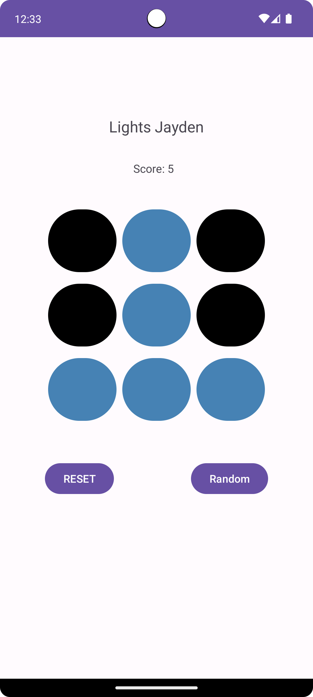

# CSC2990-LightsOut

A simple Android practice app built in **Android Studio** for CSC2990.  
This project recreates the classic **Lights Out** game on a 3x3 grid, where each circle represents a light that can be toggled on or off.  

## Features
- **3x3 Grid of Lights**: Each cell is a light that can be turned on/off by clicking it.
- **OnClickListener Practice**: Each button click toggles the state of the light.
- **Light Counter**: Keeps track of how many lights are currently on.
- **Reset Button**: Turns off all lights at once.
- **Random Button**: Randomly toggles lights on and off to create a new starting state.

## Learning Goals
This app was created as a practice exercise to:
- Gain hands-on experience with Android Studio.
- Implement `OnClickListener` for interactive UI components.
- Manage state changes in a grid-based layout.
- Work with buttons, text views, and basic UI updates in Android.

## How It Works
1. **Toggling Lights**  
   - Tap a light (circle) to switch it between ON and OFF.
   - The light counter updates in real time.

2. **Reset Button**  
   - Resets all lights to OFF.

3. **Random Button**  
   - Randomizes the ON/OFF state of all lights.

## Screenshots

## Requirements
- Android Studio
- Java / Kotlin support
- Minimum SDK: (set according to your project setup, e.g., API 21+)

## Running the App
1. Clone or download this repository.
2. Open the project in **Android Studio**.
3. Build and run on an emulator or physical device.

---

Made for **CSC2990** as a practice project.
